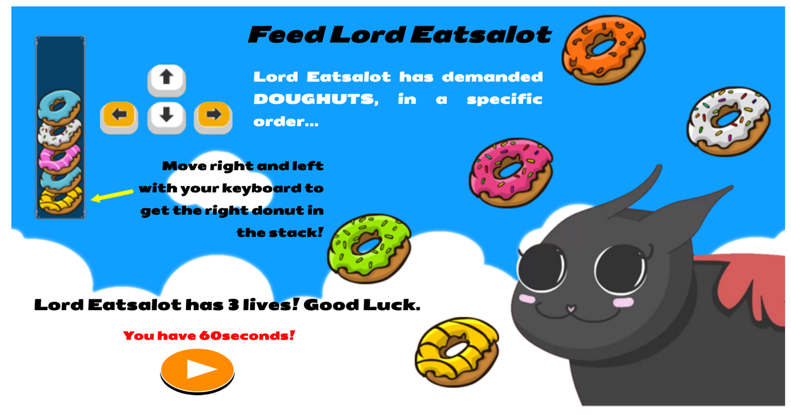

## Endless Revolution

### Background



[Feed Lord Eatsalot][live] is a 2D game, where the player's goal is to feed the pet cat snacks in the right order displayed on the right hand panel in a certain amount of time. Various type of snacks will fall from the sky where the player can move the cat left and right to catch and eat the falling snacks. As the player progress in the game and level up, the frequency and speed of the falling snacks, time remaining and number of snacks wanted will change. The player lose if he/she cannot get all the snacks in the 60 seconds or if the cat ate the three wrong snacks.


[live]: https://greenteamuimui.github.io/Feed-Lord-Eatsalot/

### GamePlay

* Eat the right donut in the bottom of the stack following Lord Eatsalot's command

* Move right and left with your keyboard arrows to move the cat left and right to eat the falling donuts

* Consume all the donuts in the stack in 60 seconds

* If accidentally eaten a wrong donut, you lose a life

* Three lives in total

### Features and implementation

Feed Lord Eatsalot was built on JavaScript and rendered on EaselJS.
Keymaster.js was used for keyboard arrow interaction for users. Conatiner Class was used to store and render donuts order and hit points(hearts).

The Ticker class was implemented to allow for rich graphics and animation. At every tick, if the game was not over, the images are drawn on each tick with its updated positions.The timer is also drawn using a text object and the runTime of the tick.

```JavaScript
startGame(event){
  this.game.step(event.delta, this.stage);
  this.game.draw();
  this.drawTimer();
  this.timer.text = `${60 - Math.floor(event.runTime/1000)} Sec`;
  this.stage.update();
  if (this.game.over === -1 || (60 - Math.floor(event.runtime/1000)) === 0) {
    this.game.displayMessage(false);
    createjs.Sound.removeSound("mySound");
    event.remove();
  } else if (this.game.over === 1){
    this.game.displayMessage(true);
    createjs.Sound.removeSound("mySound");
    event.remove();
  }
}

 beginGame() {
   createjs.Ticker.setInterval(5);
   document.onkeydown = this.handleKeyPressed;
   createjs.Ticker.reset();
   createjs.Ticker.on('tick', this.startGame);
 }
```

The movingObjects class (donuts) represents a color/type of a different donut that is created randomly. The constructor function assign the donut a name based on the randomized order and then the addOrder function behaves similarly so that the checkCollisions method can check whether the names of the eaten donut and the donut-in-order are the same. When the right donut is eaten, the donuts get deleted from the appropriate container and is then rendered as a group.


```JavaScript
class movingObects {
  constructor(stage) {
    this.stage = stage;
    this.num = Math.floor(Math.random()* 3 + 1);
    this.snackImg = new createjs.Bitmap(`./assets/images/sm-snack${this.num}.png`);
    this.x = Math.floor(Math.random()* (this.stage.canvas.width - 300 - 10)) + 10;
    this.y = 10;
    this.radius = 50;
    this.name = `snack${this.num}`;
  }
  // other code
}

//  Game Class
checkCollisions() {
  for (let i = 0; i < this.snacks.length; i++) {
    if (this.snacks[i].isEatenBy(this.cat)) {
      if (this.snacks[i].name === this.snackOrder.children[0].name) {
        this.snacks.splice(this.snacks[i], 1);
        this.snackOrder.removeChildAt(0);
        this.snackOrder.y = this.snackOrder.y + 25;
        this.happyCat();
        if (this.won()) {
          this.over = 1;
        }
      } else {
        this.snacks.splice(this.snacks[i], 1);
        this.scores.removeChildAt(this.scores.numChildren - 1);
        this.sadCat();
        if (this.gameOver()) {
          this.over = -1;
        }
      }
    }
  }
}

```
### Future Features

- [ ] Level of difficulties correlating to amount of donuts and speed   of cat and donuts
- [ ] Bonus items that increase lives
- [ ] Jumping action of cat to get donuts faster
