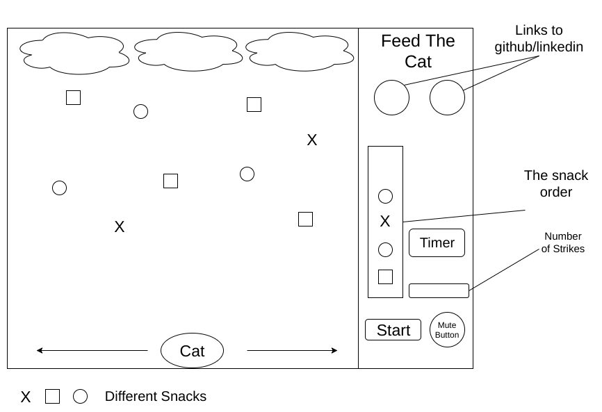

## Feed The Cat

### Background

Feed The Cat is a 2D game, where the player's goal is to feed the pet cat snacks in the right order displayed on the right hand panel in a certain amount of time. Various type of snacks will fall from the sky where the player can move the cat left and right to catch and eat the falling snacks. As the player progress in the game and level up, the frequency and speed of the falling snacks, time remaining and number of snacks wanted will change. The player lose if he/she cannot get all the snacks in the set time or if the cat ate the three wrong snacks.

### Functionality & MVP

This implementation will allow users to:

- [ ] Control the cat from going left to right
- [ ] Checking for colliding of objects(Cat and snack)
- [ ] Check for the right order of snacks
- [ ] Render different emotions of the cats based on the player's progress

In addition, this project will include:

- [ ] A fun introdution modal for the user
- [ ] A production Readme

### Wireframes

This app will consist of a single screen with a game canvas divided into two parts. The major area on the left is where the player controls the cat and interact with the falling snacks. The left panel will diplay the order needed to be matched, links to my Github, my LinkedIn and the current level and start button. The player will have the option to start the game and mute the sound effects along the game.

### Architecture and Technologies

This project will be implmemented with the following technologies:
- Vanilla JavaScript and `jquery` for overall structure and game logic.
- `Easel.js` with `HTML5 Canvas` for DOM manipulation and rendering.
- Keymaster.js to set arrow keys for player movement
- Webpack to bundle and serve up the various scripts.

In addition to the webpack entry file, there will be other scripts involved in the project:

`main.js`: this script will handle the logic for creating and updating the necessary `Easel.js` elements and rendering them to the DOM.

`game.js`: this script will handle the game logic. It will keep track of the order of the snacks, the time remaining and spawn snacks from the sky falling.

`snacks.js`: this script will set up the base functionality for the falling snacks.

`cat.js`: this script will house the constructor and moving functions for the cat object.

### Implementation Timeline

**Day 1**: Setup all necessary Node modules, including getting webpack up and running and `Easel.js` installed. Write a basic entry file. Learn the basics of `Easel.js`. Goals for the day:

- Setup webpack
- Render game bacground onto `Canvas` element

**Day 2**: Build `Snacks` and `Cat` object. Connect `Cat` and `Snacks` object to `Game` object. Then use `main.js` to create and render cats and snacks. Build the ability to control the cat using Keymaster. Goals for the day:

- Complete the `snacks.js` and `cat.js`
- Render the cat and falling snack to `Canvas` using `Easel.js`
- Make cat movable

**Day 3**: Create the logic for the game(keep tracking snack order, what happened after collision between cat and snacks). Goals for the day:

- Build `Game` logic, tracking of snacks order
- Implement game logic for cat and snacks interaction

**Day 4**: Finish up any functionality not already implemented. Style the frontend, making it polished and professional. Goals for the day:

- Style `Canvas`, nice looking controls and title.
- Finish app

### Bonus Features

- [ ] Add more levels
- [ ] Add sound effect and background music
- [ ] Add bonus snacks and features
